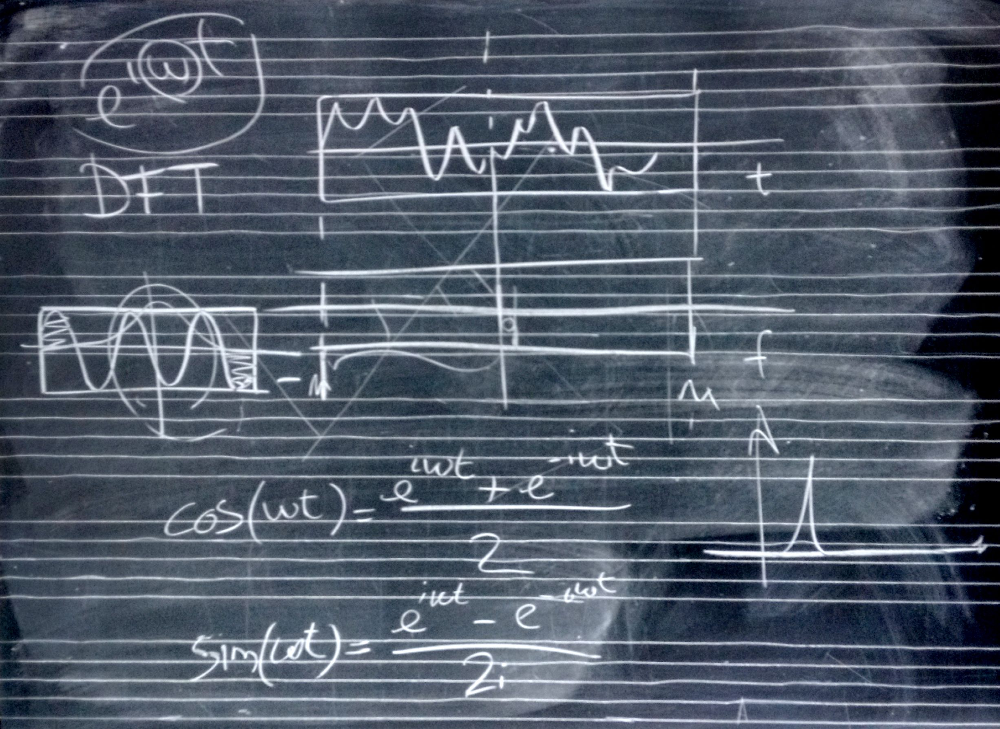

# Lezione del 27 gennaio 2016

## Argomenti

* realizzazione di una DFT complessa in `octave` (*bin-synchronous*)
* realizzazione di una DFT complessa in `octave` (*bin-asynchronous*)
* realizzazione di una DFT reale in `octave` (*bin-asynchronous*)
* finestre: la necessità di una finestra asimmetrica
* sincronia e asincronia con i bin

## Compiti per casa

* plottare le finestre analitiche delle frequenze adiacenti alla frequenza
  analizzata (nel tempo)
