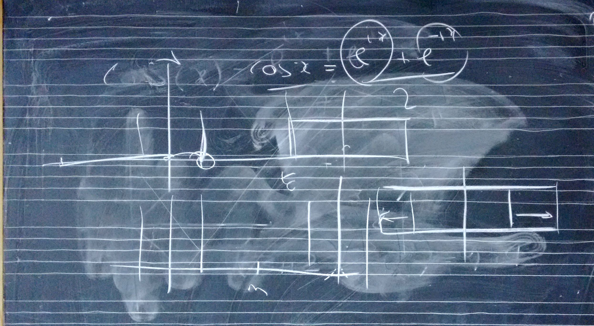

# Lezione del 23 marzo 2016

## Argomenti

* correzione del compito per casa
  * funzione del *windowing* e problematiche connesse (trade-off rumore/risoluzione frequenziale)
* *zero-padding* come interpolazione
