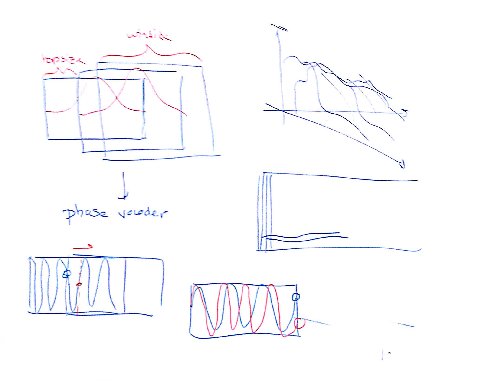

# Lezione del 20 aprile 2016

## Argomenti

* introduzione alla STFT
  * sequenza
  * overlap/add
  * hopsize
  * trade-off risoluzione temporale/risoluzione frequenziale
  * creare uno spettrogramma
