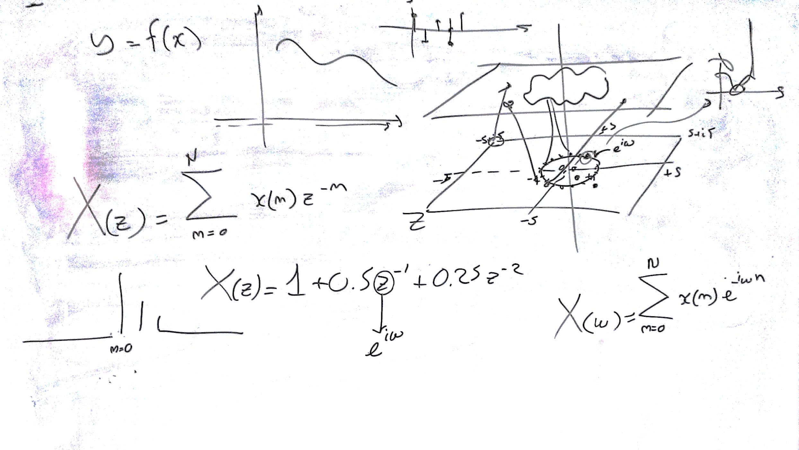
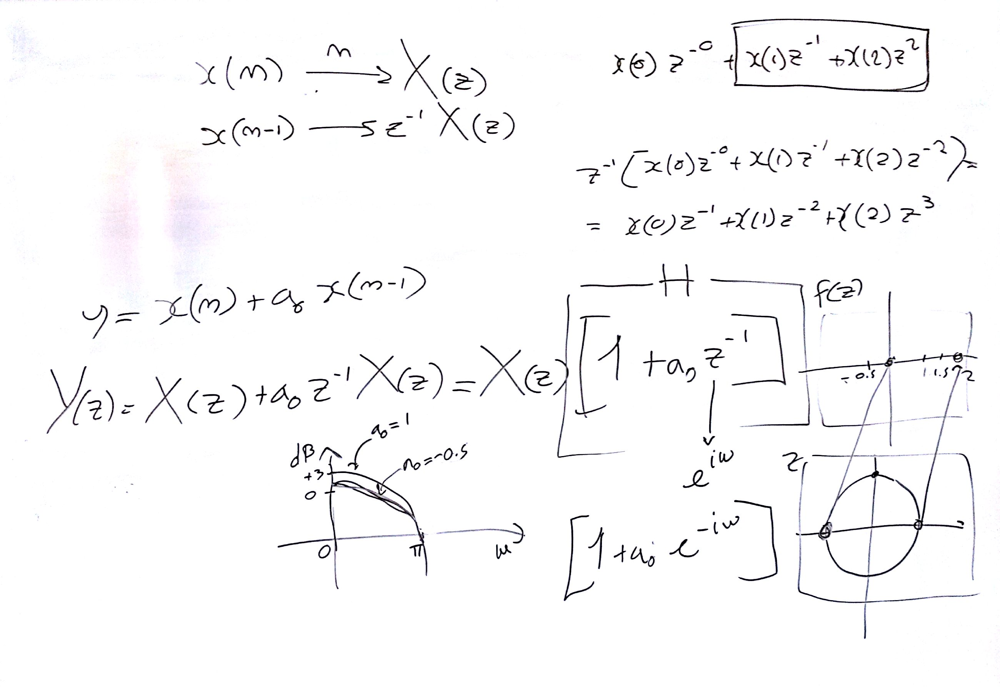
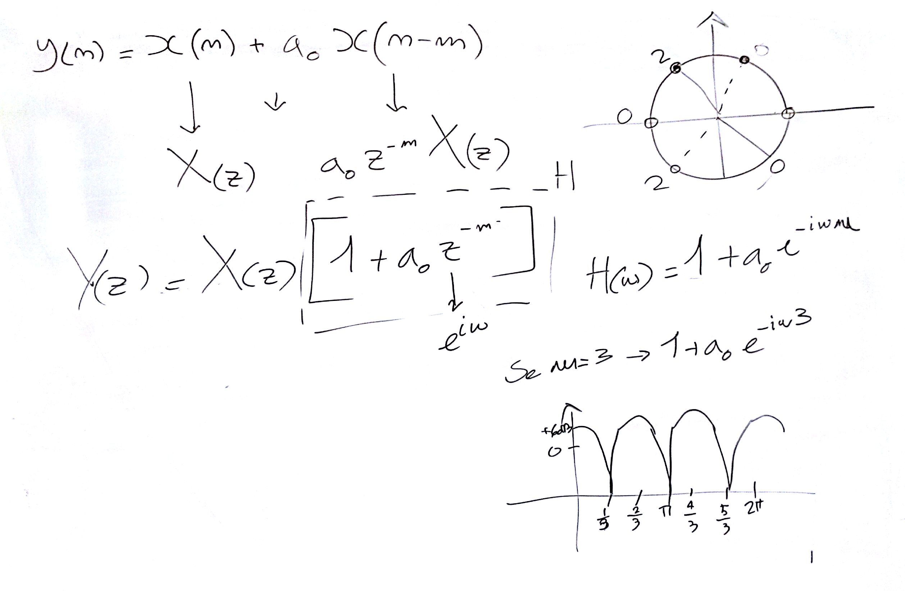
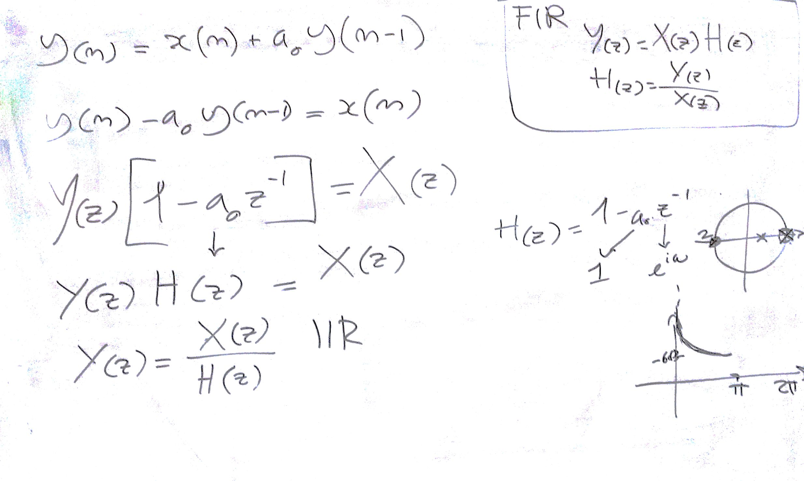

# Lezione del 22 giugno 2016

## Argomenti

* trasformata Z: descrizione e proprietà
* il piano Z in `octave`
* filtri del prim'ordine in `octave`: one zero, one pole
  * formule dei filtri `time-domain`
  * risposte in frequenza
