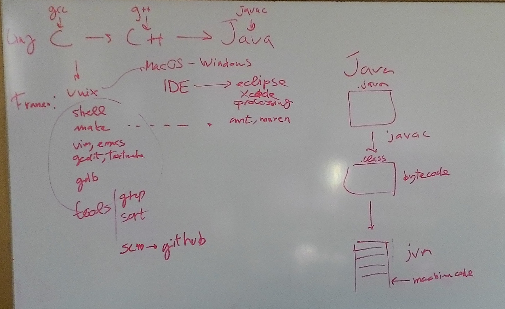

# Lezione del 18 dicembre 2015

Introduzione alla programmazione:

* overview dei linguaggi compilati: `C`, `C++`, `Java`
  
* `C`:
  * funzioni, compilazione, `make`
  * strutture dati
  * puntatori a funzione => introduzione agli oggetti

## Compiti per casa

* Rivedere i programmi fatti in classe
* elaborare variazioni sul tema
