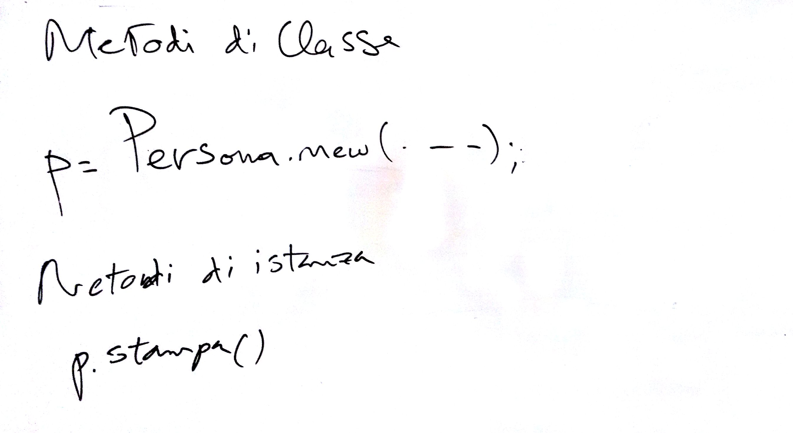

# Lezione del 22 gennaio 2016


----


* Riscritto il programma `persona` e `studente` in:
  * `SuperCollider`
```superCollider
# persona.sc
Persona{
	classvar count_ = 1;
	var <nome, cognome, num_telefono, <>id;
	*new { arg nome, cognome, num_telefono;
		var myObject;
		myObject = super.newCopyArgs(nome, cognome, num_telefono);
		myObject.id = count_;
		count_ = count_ + 1;
		^myObject
	}
	*count{
		^(count_-1)
	}
	stampaln {
		nome.postln;
		cognome.postln;
		num_telefono.postln;
		id.postln;
		Persona.count.postln;
	}
	stampaf{
		postf("Questo è il nome: %\nQuesto è il cognome: %\nE puoi chiamarlo qui: %\nId: %/%\n", nome, cognome, num_telefono, id, Persona.count);
	}
}

# studente.sc
Studente : Persona{
	var <>matricola;
	stampaln{
		super.stampaln;
		matricola.postln
	}
}

# console.sc
Server.local.makeGui

s.reboot
(
a = Persona.new('a', 'b', 23);
b = Persona.new('Federico', 'Barbagianni', 74239);
c = Persona.new('califfo', 'califano', 1234567);
)

d = Studente.new('m', 'n', 16)
d.matricola = 23
d.stampaln
d.stampaf


a.stampaf
b.stampaf
c.stampaf
c.stampaln
```
