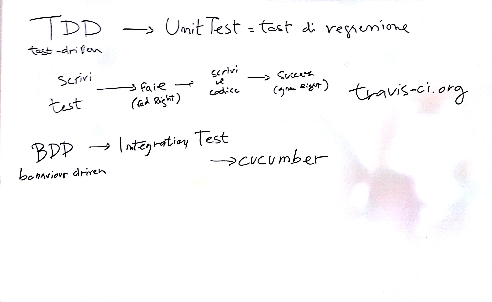

# Lezione del 05 febbraio 2016




## Argomenti

* Test-driven Development
* Behaviour-driven Development
* tools per l'integrazione continua:
  * https://travis-ci.org
  * https://codeclimate.com
* Riscrivere il programma `persona` in:
  * `Java`

## Java

* Ereditarietà singola:
```java
public class Persona{
	public String nome, cognome;
	public int numTelefono;
	Persona(String n, String c, int num)
	{
		this.nome = n;
		this.cognome = c;
		this.numTelefono = num;
	}
	public void stampa()
	{
		System.out.println("Questo è il nome: " + nome + "\nQuesto è il cognome: " + cognome + "\nE puoi chiamarlo qui: " + numTelefono);
	}
}
```
