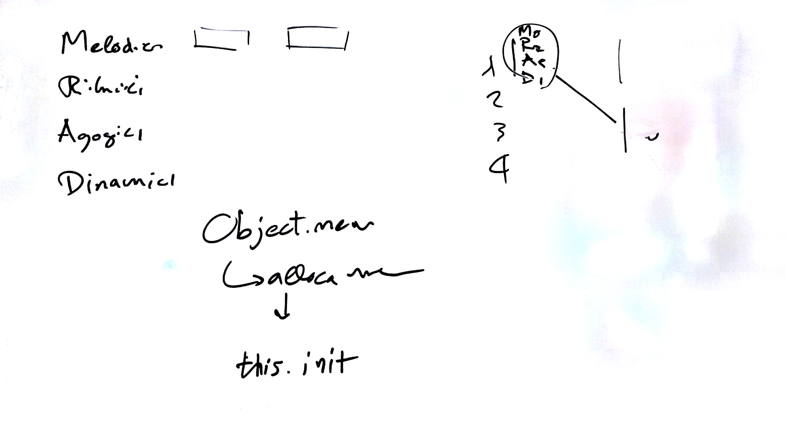

# Lezione del 4 marzo 2016

## Argomenti

* Elaborazione di un sistema di composizione algoritmica in `supercollider`
  * quadro generale
  * moduli ritmici
  * moduli frequenziali:
    * prime forms
    * armonie spettrali
    * espansioni seriali
