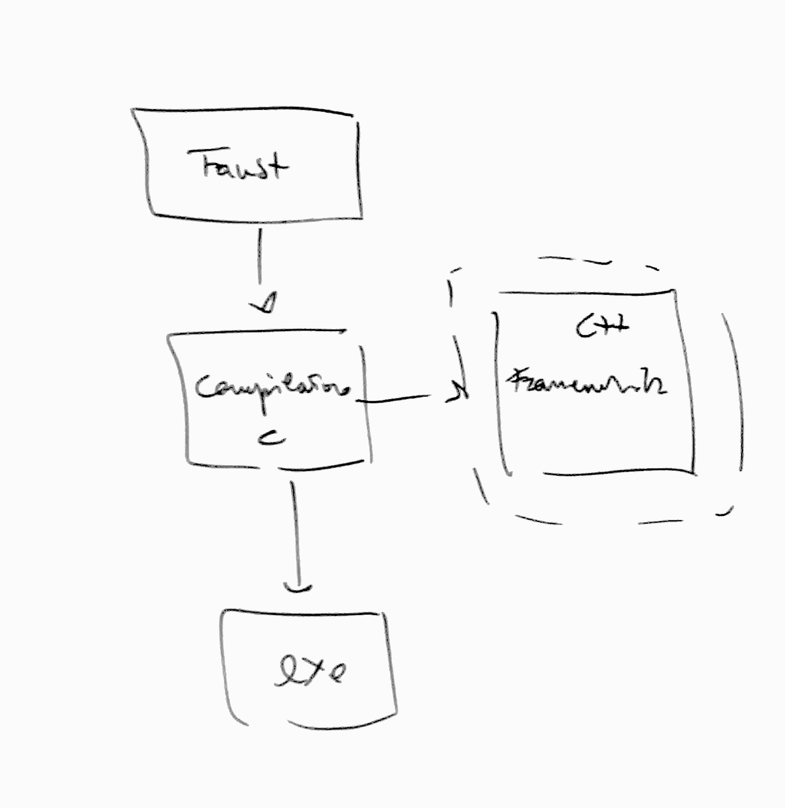

# Lezione del 13 maggio 2016



## Argomenti

* Refactoring delle lezioni: d'ora in avanti le tre ore di lezione saranno
  divise in due parti:
  * una parte dedicata allo studio del linguaggio `faust` e a seguire
    dell'ambiente `processing`
  * una parte dedicata alla composizione assistita e alla composizione
    algoritmica
* Introduzione al linguaggio `faust` attraverso la realizzazione del primo
  programma: `noise.dsp`:

```faust
declare name 		"Noise";
declare version 	"1.1";
declare author 		"Grame";
declare license 	"BSD";
declare copyright 	"(c)GRAME 2009";


//-----------------------------------------------------------------
// Noise generator and demo file for the Faust math documentation
//-----------------------------------------------------------------


<mdoc>
\section{Presentation of the "noise.dsp" Faust program}
This program describes a white noise generator with an interactive volume, using a random function.

\subsection{The random function}
The \texttt{random} function describes a generator of random numbers, which equation follows. You should notice hereby the use of an integer arithmetic on 32 bits, relying on integer wrapping for big numbers.
<equation>random</equation>

\subsection{The noise function}
The white noise then corresponds to:
<equation>noise</equation>
</mdoc>

random  = +(12345)~*(1103515245);
noise   = random/2147483647.0;

<mdoc>
\subsection{Just add a user interface element to play volume!}
Endly, the sound level of this program is controlled by a user slider, which gives the following equation: 
<equation>process</equation>
</mdoc>

<mdoc>
\section{Block-diagram schema of process}
This process is illustrated on figure 1.
<diagram>process</diagram>
</mdoc>

process = noise * vslider("Volume[style:knob]", 0.2, 0, 1, 0.1);

<mdoc>
\section{Notice of this documentation}
You might be careful of certain information and naming conventions used in this documentation:
<notice/>

\section{Listing of the input code}
The following listing shows the input Faust code, parsed to compile this mathematical documentation.
<listing/>
</mdoc>
```
