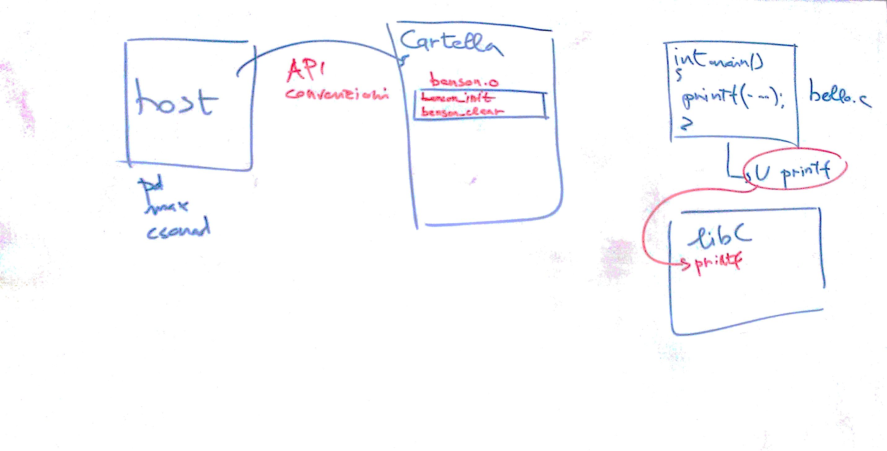

# Lezione del 3 giugno 2016



## Argomenti

* Descrizione dei meccanismi di `plugin` e di `dynamic linking`
  * rielaborazione analitica del programma `hello.c`
```c
#include <stdio.h>
int main()
{
  printf("hello richard benson\n");
}
```
* Studio delle primitive del linguaggio `faust`
  * elaborazione del programma `mysum.dsp`
```faust
mysum (x, y, z) = x+((y*z)/vslider("vquote",1,1,23,0.1));
process = mysum(_,_,23);
```
  * elaborazione del programma `mysplit.dsp`
```faust
mysplit (x) = x<:x,x;
process = mysplit(_);
```
