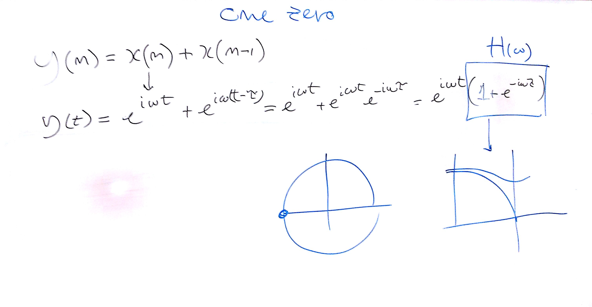

# Lezione del 17 giugno 2016

## Argomenti

* analisi verifica della realizzazione di `pan.dsp` di Federico Paganelli
* schematizzazione di un `phase vocoder` analogico
* realizzazione di `one zero.dsp` riprendendo dalla `filterlib.lib` di Julius Smith
* realizzazione di `one pole.dsp`
