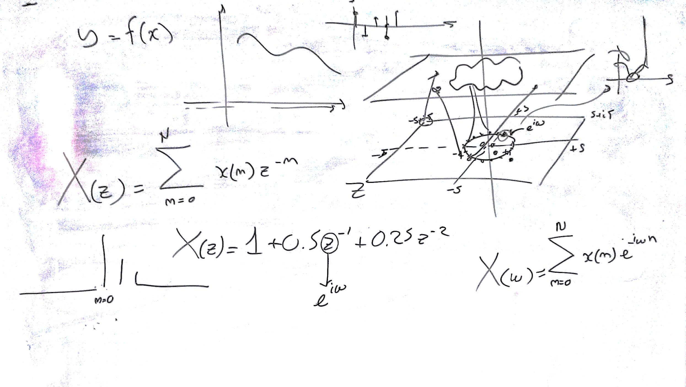
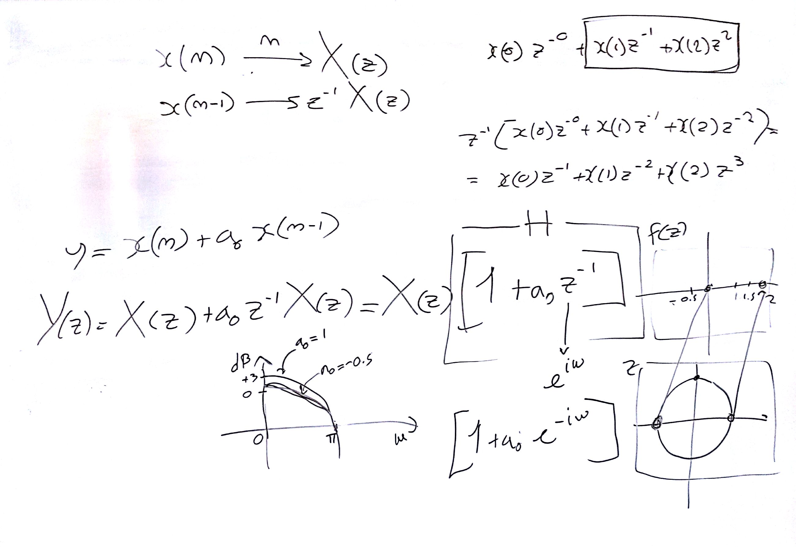
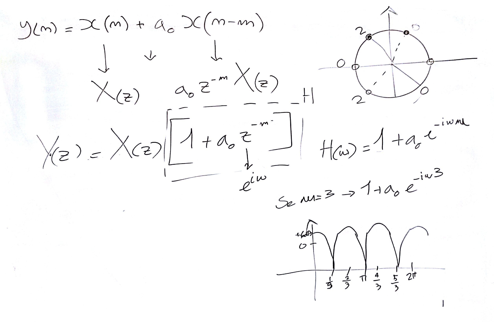
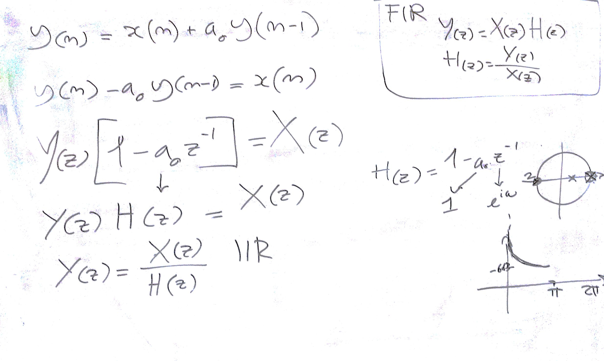

# Lezione del 16 dicembre 2016 (ENSM)

## Argomenti

* ripasso dei filtri
  * funzione complessa e funzione reale
  * piano Z
  * trasformata Z
  * risposta all'impulso
  * risposta in frequenza
  * filtri di prim'ordine
  * filtri comb
  * filtri FIR e filtri IIR
