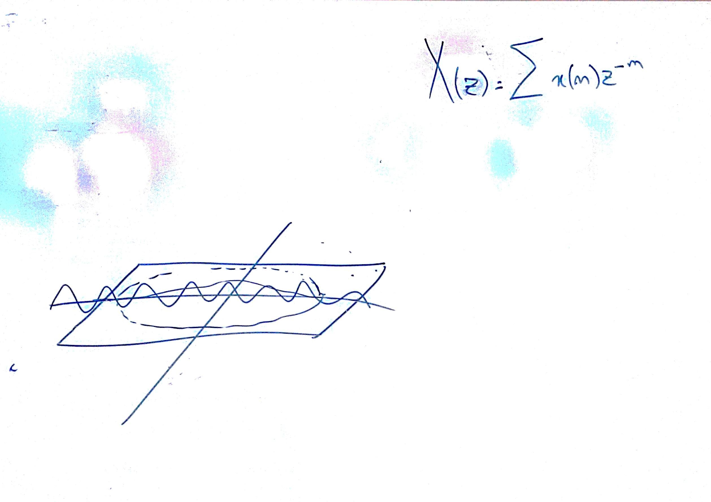
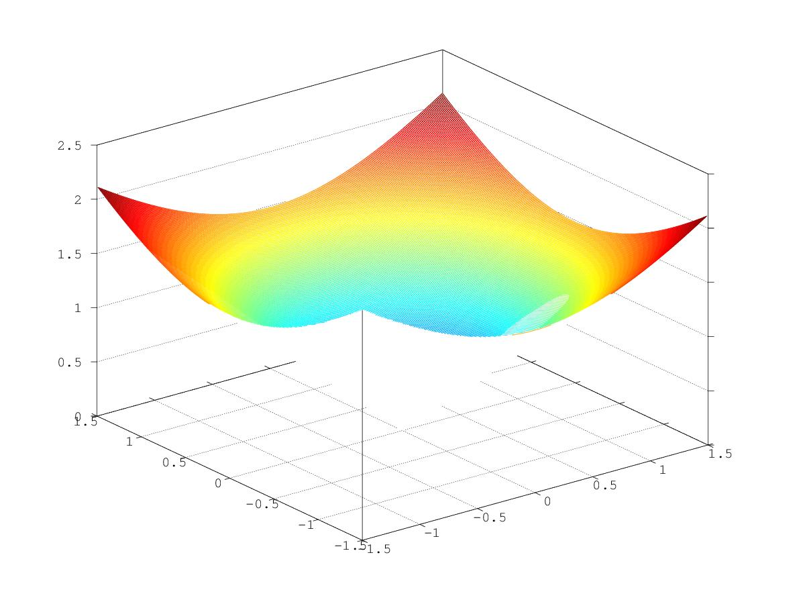

# Lezione del 26 gennaio 2017 (ENSM)



## Argomenti

* implementazione in `octave` di una *trasformata zeta* di un segnale reale
  * implementazione del piano Z (`pianoz.m`)
  * implementazione della trasformata Z (`transz.m`)
  * *script* di test (`testz.m`)

## Codice

`pianoz.m`:
```octave
% -*- texinfo -*-
% @deftypefn {pianoz.m} {@var{Z} =} pianoz (@var{rlimits}, @var{ilimits}, @var{step})
% @cindex 1 z-plane
% create a Z-plane filled up from complex values drawn upon @var{rlimits} and
% @var{ilimits} (two-member arrays with lo-hi values). @var{step} provides the step to
% be observed in those ranges.
%
% It returns the created Z-plane.
%
% @seealso{transz}
% @end deftypefn
%
function Z = pianoz(rlimits, ilimits, step)
	raxis = [rlimits(1):step:rlimits(2)-step];
	iaxis = [ilimits(1):step:ilimits(2)-step];
	Z = zeros(size(raxis, 2), size(iaxis, 2));

	for m = 1 : size(raxis, 2)
		for n = 1 : size(iaxis, 2)
			Z(m, n) = raxis(m) + i*iaxis(n);
		end
	end

	Z;
end
```

`transz.m`:
```octave
% -*- texinfo -*-
% @deftypefn {transz.m} {@var{Z} =} transz (@var{x}, @var{step})
% @cindex 2 z-transform
% performs a Z transform
%
% @tex
% $$
%    X(z) = \sum_{n = -\inf}^{\inf}{x(n) z^{-n}}
% $$
% @end tex
% @ifnottex
% @example
% @group
%          ----
%          \         -n
%   X(z) =  ) x(n) z
%          /
%          ----
% @end group
% @end example
% @end ifnottex
% @noindent
%
% of a hanning-windowed real function @var{x} over a complex plane and returns a matrix @var{Z}
% containing the results.
%
% @seealso{transz, hanning}
% @end deftypefn
%
function Z = transz(x, step)
	[nrows ncols] = size(x);
	limits = [-0.5*ncols*step 0.5*ncols*step];
	Z = pianoz(limits, limits, step);
	h = hanning(ncols)';
	xwin = x.*h;
	tz = zeros(size(Z));
	n = [1:size(xwin, 2)];

	for r = 1:size(Z, 2)
		for c = 1:size(Z, 1)
			zval = Z(r, c);
			zmenon = zval.^(-n);
			tz(r, c) = sum(xwin(n).*zmenon);
		end
	printf(".")
	fflush(stdout);
	end

	tz;
end
```

`testz.m`:
```octave
step = 0.01;
f = 5;
limits = [-1.5 1.5];
raxis = [limits(1):step:limits(2)-step];
y = cos(2*pi*f*raxis);

%h = hanning(size(y, 2))';
%y = y.*h;

tz = transz(y, step);

mesh(raxis, raxis, abs(tz))
```

## Output


