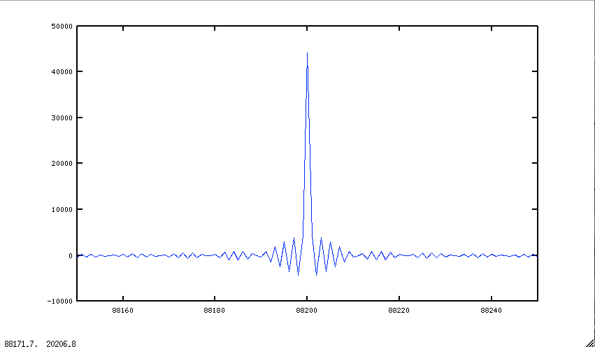

# Lezione del 16 febbraio 2017 (ENSM)

## Argomenti

* realizzazione di un impulso attraverso la convoluzione di un chirp con se
  stesso rovesciato

```matlab
setenv("GNUTERM", "x11");

fc=44100;
sinc=1/fc;
dur=2;
t=[0:sinc:dur-sinc];
f0=20;
f1= 20000;
t1= t(size(t,2));
y= chirp(t,f0,t1,f1);
yr=fliplr(y);
ir=conv(y,yr);

plot(ir)
```

che produce


