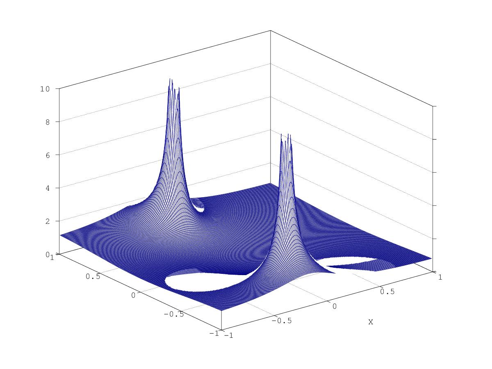

# Lezione del 2 marzo 2017 (ENSM)


## Argomenti

* filtri `IIR` di ordine superiore al primo 

```matlab
step = 0.01;
xlimits = [-1, 1];
w = [0:step:2*pi - step];
x = [xlimits(1):step:xlimits(2) - step];
Z = pianoz(xlimits, xlimits, step);
H = 0.5./(1 + 0.3*Z.**(-1) + 0.5*Z.**(-2));

mesh(real(Z), imag(Z), abs(H))
xlabel('X')
axis([xlimits(1) xlimits(2) xlimits(1) xlimits(2) 0 10])
```

che produce



* filtri generici del second'ordine:

```matlab
% Generica funzione di trasferimento del II ordine definita a partire dai zeri e dai poli
step = 0.01;
xlimits = [-1, 1];
w = [0:step:2*pi - step];
x = [xlimits(1):step:xlimits(2) - step];
Z = pianoz(xlimits, xlimits, step);

zero1 = -0.35000 +i*0.42131;
zero2 = -0.35000 -i*0.42131;
polo1 = -0.15000 +i*0.69101;
polo2 = -0.15000 -i*0.69101;

numer = (Z.-zero1).*(Z.-zero2);
denom = (Z.-polo1).*(Z.-polo2);
H = numer./denom;

%         con questa scelta di poli e zeri la H corrisponde a:
%         H = (1 +0.7*Z.**(-1) + 0.3*Z.**(-2))./(1 + 0.3*Z.**(-1) + 0.5*Z.**(-2));

mesh(real(Z), imag(Z), abs(H))
xlabel('X')
axis([xlimits(1) xlimits(2) xlimits(1) xlimits(2) 0 10])
```

che produce:


