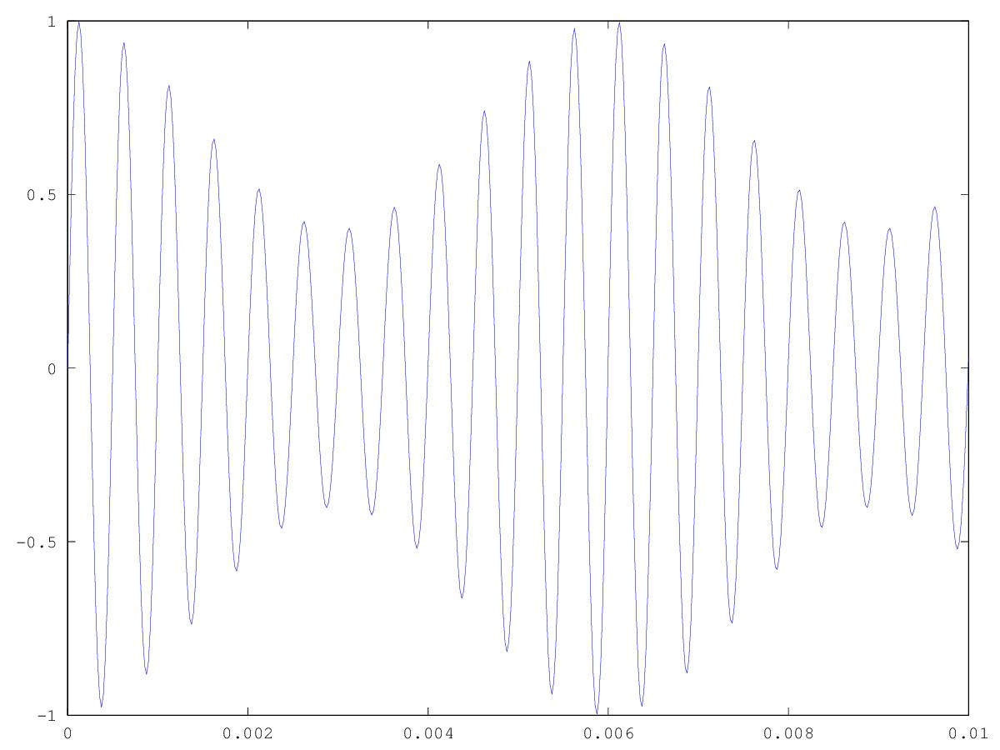
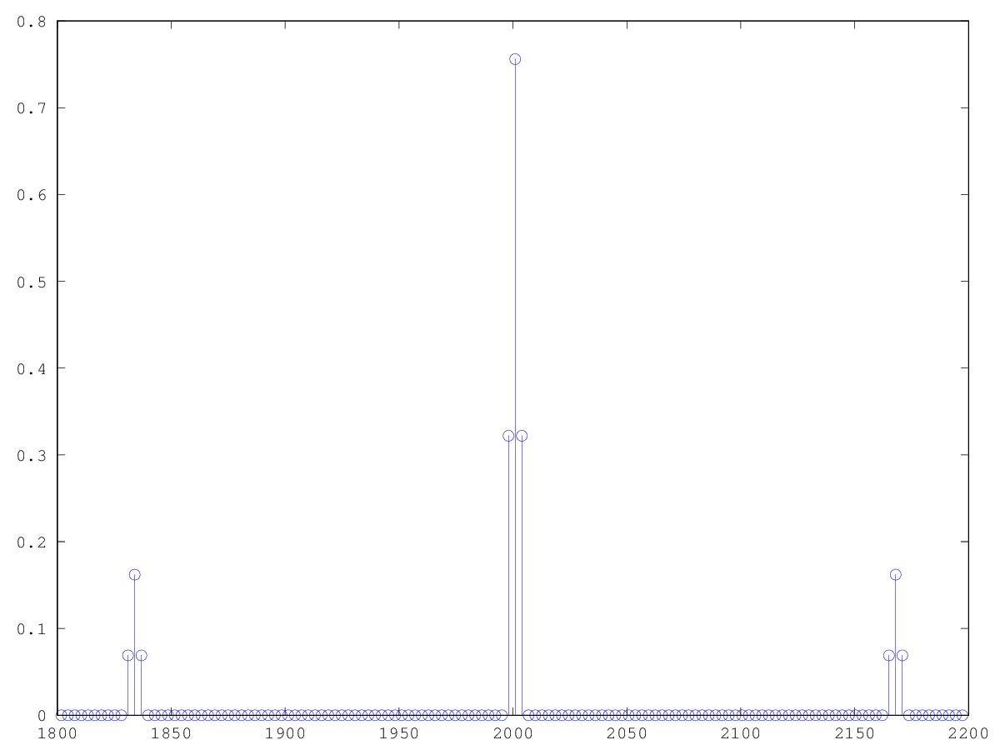

# Lezione del 23 marzo 2017 (ENSM)

## Argomenti

* Panariello:
  * verifica degli `onset detectors` realizzati a casa
* Mascaro:
  * realizzazione con `octave` dell'algoritmo
    della modulazione d'ampiezza
    presente in Zwicker-Fastl, pag.2

## Codice

```matlab
%zwiker fastl AM tone pag 2
setenv("GNUTERM", "x11");

fc = 48000;
sinc = 1/fc;
winsize = 16384;
binsize = fc/winsize;

dur = 2;
t = [0:sinc:dur-sinc];
Tm = 0.006; %periodo della modulante
Fm = round((1/Tm)/binsize)*binsize;	%frequenza della modulante
Fp = round(2000/binsize)*binsize; %frequenza carrier

im = 0.3; %indice di modulazione

m = 1-im+im*cos(2*pi*Fm*t);	%modulante
p = m.*sin(2*pi*fp*t);

figure(1)
plot(t,p)
axis([0 0.01])
print("am.pdf", "-dpdf");

figure(2)

F = [0:binsize:fc-binsize];
h = hamming(winsize)';
pfft = fft(h.*p(1:winsize),winsize);
stem(F,4*abs(pfft)/winsize);
axis([1800 2200])
print("amfft.pdf", "-dpdf");

wavwrite(p',fc,"AM.wav")
```

* che produce la funzione che segue con la sua trasformata
     
     
