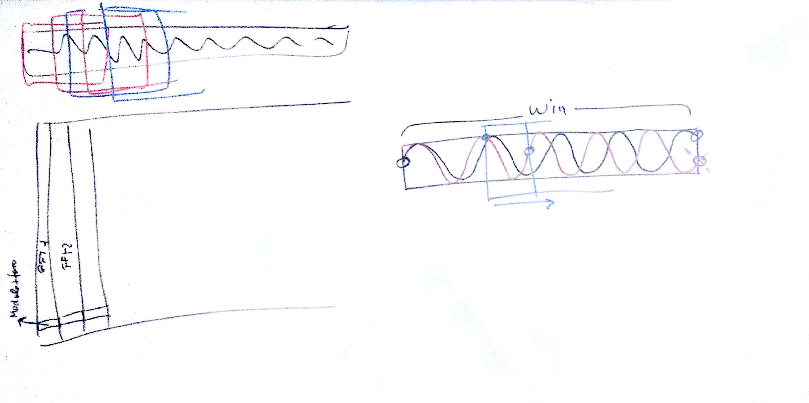

# Lezione del 4 luglio 2017 (ENSM)

## Argomenti

* Mascaro:
  * analisi e realizzazione di finestre per la sintesi granulare:
    `hamming`, `kaiser` del primo ordine e `kaiser-bessel derivative` (`KBD`)
  * realizzazione delle suddette funzioni in `octave`
* Paganelli:
  * introduzione all'analisi e realizzazione in `octave` di un *phase vocoder* 
