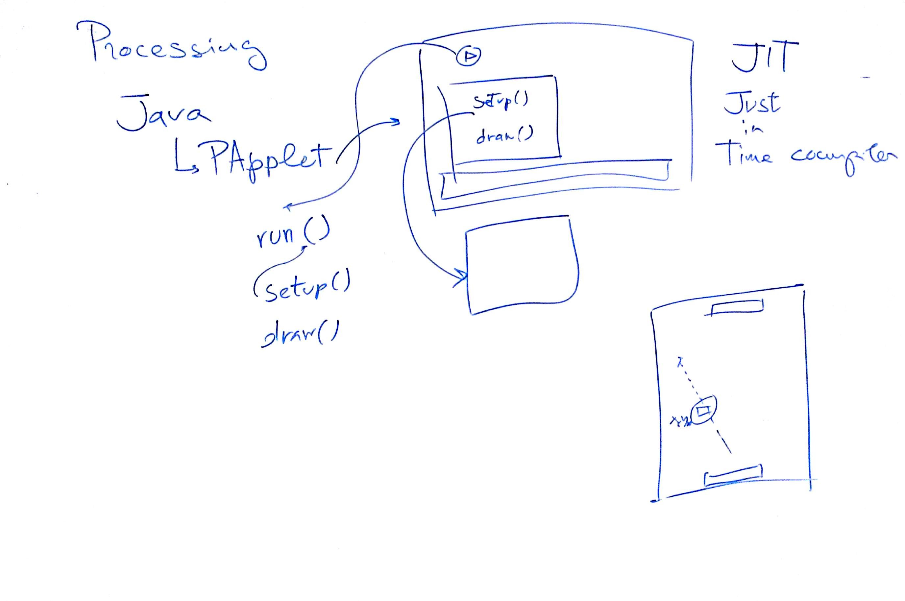
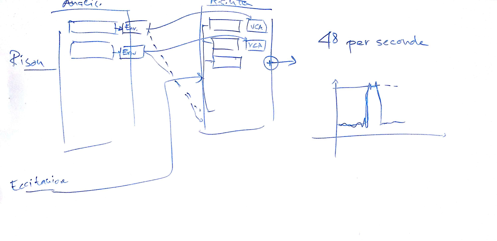
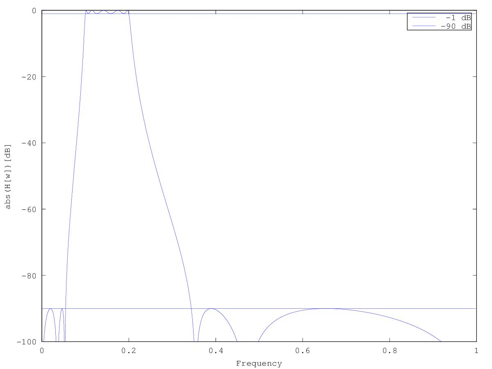

# Lezione del 20 gennaio 2017 (programmazione)




## Argomenti

* `processing`:
  * funzionamento interno
  * il concetto di *flow*
* Simulazione di un vocoder analogico a 48 bande (filtri di seconda maggiore) con `faust`:
  * realizzazione di un filtro ellittico in `octave`

```octave
%
% lifted off quite literally from:
% https://octave.sourceforge.io/signal/function/ellip.html
%
% slightly modified
% thoroughly tested and stressed
% 
fc = 1.0;
passband_ripple = 1;
stopband_attenuation = 90;
passband_frequencies = [.1 .2] ;
stopband_frequencies = [.01 .4]; % if stopband frequencies contain the passband then it is a bandpass filter

[filter_order, Ws] = ellipord (passband_frequencies, stopband_frequencies, passband_ripple, stopband_attenuation) % we want to read the coefficients
[b, a] = ellip (filter_order, passband_ripple, stopband_attenuation, passband_frequencies);
[h, w] = freqz (b, a);

plot (w./pi, 20*log10 (abs (h)), ";;")
xlabel ("Frequency");
ylabel ("abs(H[w])[dB]");
axis ([0, 1, -100, 0]);

hold ("on");
x=ones (1, length (h));
plot (w./pi, x.*-1, ";-1 dB;")
plot (w./pi, x.*-90, ";-90 dB;")
hold ("off");
```

gives:


