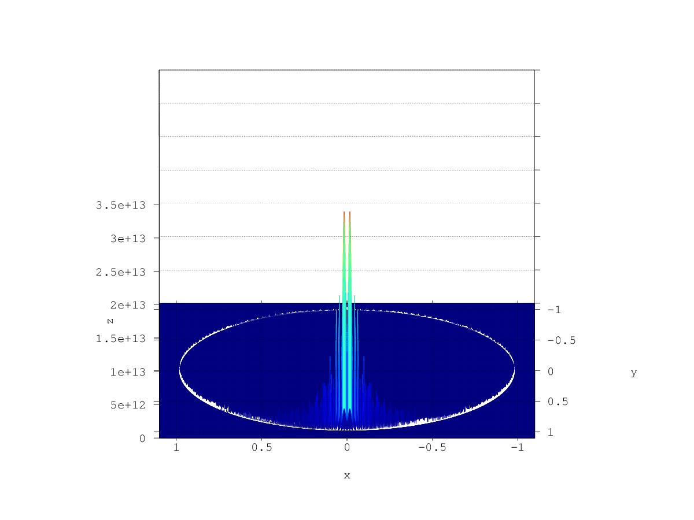
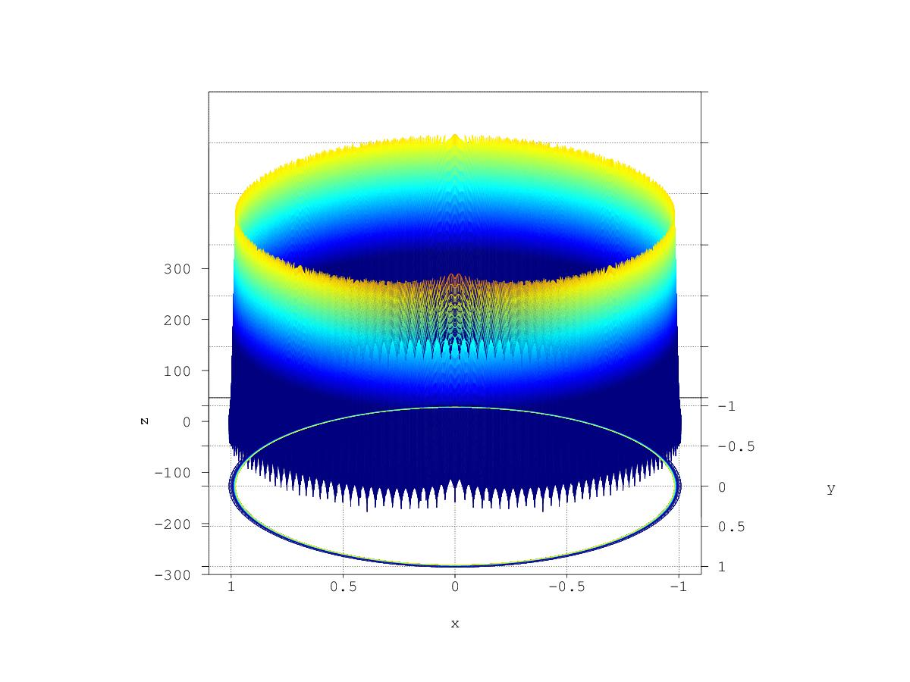

# Lezione del 2 febbraio 2017 (programmazione)


## Argomenti

* realizzazione di una *Short-time Z-transform* animata in `processing`
  * analisi dell'algoritmo in `octave`
  * scelta delle condizioni al contorno (ciambella tra -0.9 e 1.1)
  * inizio di strutturazione della libreria `processing`

## Codice

* `pianoz.m`:

```octave
% -*- texinfo -*-
% @deftypefn {pianoz.m} {@var{Z} =} pianoz (@var{rlimits}, @var{ilimits}, @var{step})
% @cindex 1 z-plane
% create a Z-plane filled up from complex values drawn upon @var{rlimits} and
% @var{ilimits} (two-member arrays with lo-hi values). @var{step} provides the step to
% be observed in those ranges.
%
% It returns the created Z-plane.
%
% @seealso{transz}
% @end deftypefn
%
function Z = pianoz(rlimits, ilimits, step)
	raxis = [rlimits(1):step:rlimits(2)-step];
	iaxis = [ilimits(1):step:ilimits(2)-step];
	Z = zeros(size(raxis, 2), size(iaxis, 2));

	for m = 1 : size(raxis, 2)
		for n = 1 : size(iaxis, 2)
			Z(m, n) = raxis(m) + i*iaxis(n);
		end
	end

	Z;
end
```

* `transz.m`:

```octave
% -*- texinfo -*-
% @deftypefn {transz.m} {@var{Z} =} transz (@var{x}, @var{step})
% @cindex 2 z-transform
% performs a Z transform
%
% @tex
% $$
%    X(z) = \sum_{n = -\inf}^{\inf}{x(n) z^{-n}}
% $$
% @end tex
% @ifnottex
% @example
% @group
%          ----
%          \         -n
%   X(z) =  ) x(n) z
%          /
%          ----
% @end group
% @end example
% @end ifnottex
% @noindent
%
% of a hanning-windowed real function @var{x} over a complex plane and returns a matrix @var{Z}
% containing the results.
%
% @seealso{transz, hanning}
% @end deftypefn
%
function tz = transz(x, step)
	[nrows ncols] = size(x);
	limits = [-0.5*ncols*step 0.5*ncols*step];
	Z = pianoz(limits, limits, step);
	h = hanning(ncols)';
	xwin = x.*h;
	tz = zeros(size(Z));
	n = [1:size(xwin, 2)];

	for r = 1:size(Z, 2)
		for c = 1:size(Z, 1)
			zval = Z(r, c);
			if (abs(zval) > 0.98 && abs(zval) < 1.01)
			zmenon = zval.^(-n);
			tz(r, c) = sum(xwin(n).*zmenon);
			endif
		end
		%if (abs(tz(r, c)) > 1) tz(r, c)=1;
		%endif
		printf("%.2f %%\n", r*100/size(Z, 2))
		%printf(".")
		fflush(stdout);
	end

	tz;
end
```

* `testz.m`

```octave
step = 0.001;
f = 5;
limits = [-1.2 1.2];
raxis = [limits(1):step:limits(2)-step];
yc = cos(2*pi*f*raxis);
ys = square(raxis*20);

tz = transz(ys, step);

figure(1, "visible", "off");
mesh(raxis, raxis, abs(tz)/(size(raxis, 2)**2));
view([180 30])
axis([-1.1 1.1 -1.1 1.1])
xlabel("x");
ylabel("y");
zlabel("z");
caxis([0 4e13])
print("z_transform-linear.jpg", "-djpeg");

figure(2, "visible", "off");
meshc(raxis, raxis, 20*log10(abs(tz)/(size(raxis, 2)**2)));
view([180 30])
axis([-1.1 1.1 -1.1 1.1])
xlabel("x");
ylabel("y");
zlabel("z");
caxis([0 350])
print("z_transform-dB.jpg", "-djpeg");
```

produce:



La magnitudine della trasformata di Fourier dell'onda quadra reale spedita in ingresso può essere
notata sulla parte destra del cerchio unitario a partire da y0, mentre la
parte sinistra è il complesso coniugato simmetrico.

Plottando in `dB`, si ottiene:



È chiaro che in questi plot il riscalamento *è sbagliato*.
