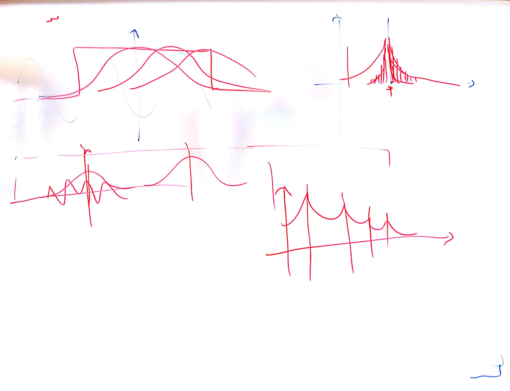
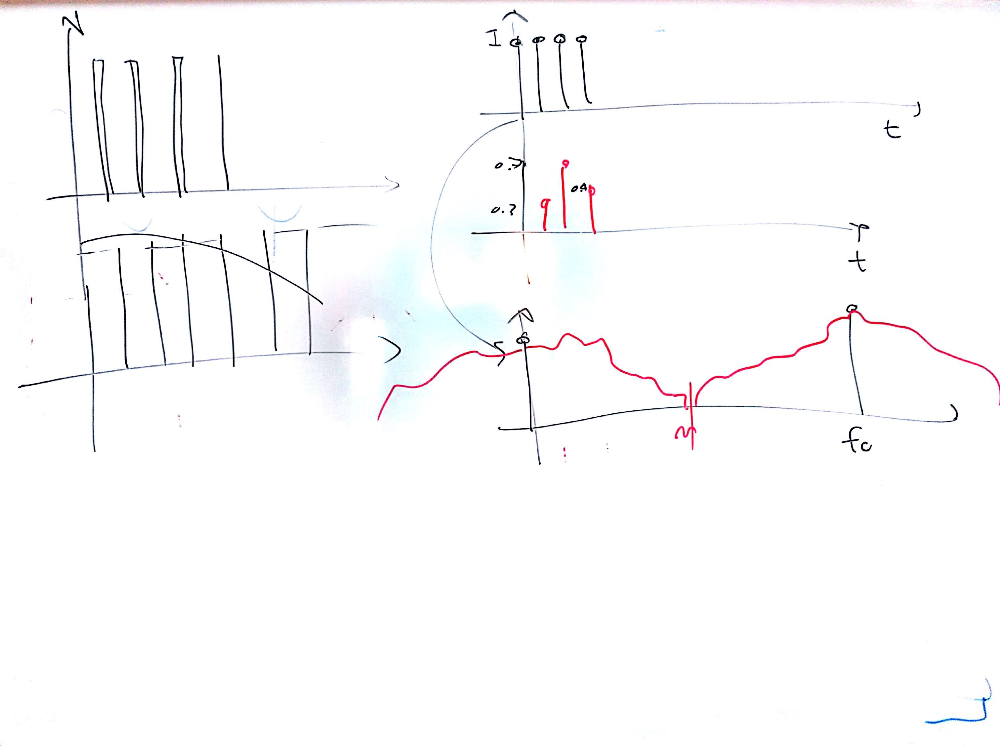

# Lezione del 17 marzo 2017 (programmazione)

## Argomenti

* Panariello: progresso nel progetto [`multidb`](https://github.com/clapana/multidb)
  * inizio della funzione di `onset detection` dell'audio
* Mascaro: revisione di:
  * sintesi granulare, con particolari applicazioni alla *FOF* (*forme d'onde formantique*)
  * campionamento visto come modulazione d'ampiezza
