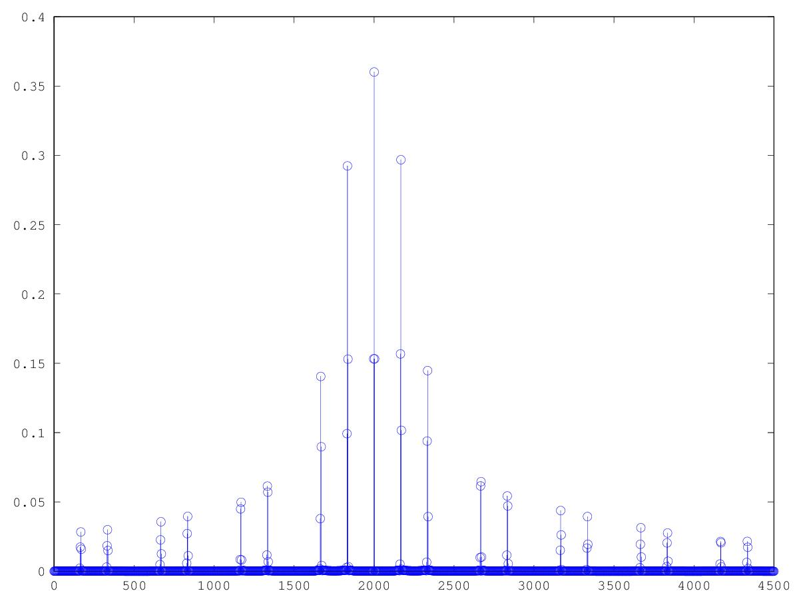

# Lezione del 24 marzo 2017 (programmazione)

## Argomenti

* Mascaro:
  * realizzazione con `octave` degli algoritmi
    riguardanti la *pulse-width modulation* e i *DC pulse*
    presenti in Zwicker-Fastl, pag.2

## Codice

* `tone_pulse.m`:

```matlab
%zwiker fastl AM tone pag 2
setenv("GNUTERM", "x11");

fc = 48000;
sinc = 1/fc;
winsize = 16384;
binsize = fc/winsize;

dur = 2;
t = [0:sinc:dur-sinc];
Tm = 0.006; %periodo della modulante
Fm = round((1/Tm)/binsize)*binsize;	%frequenza della modulante
msamples = round(Tm/sinc);
d_cycle = 1/3; %fa la spaziatura ogni 3
msampleHigh = round(msamples*d_cycle);
squareTable = zeros(1,msamples);
squareTable(1:msampleHigh) = 1;
squareWav = zeros(size(t));
for k = 1:msamples:size(t,2)
	squareWav(k:k+msamples-1) = squareTable;
end
Fp = round(2000/binsize)*binsize; %frequenza carrier

im = 0.3; %indice di modulazione

m = squareWav;	%modulante
p = m(1:size(t,2)).*sin(2*pi*Fp*t);

figure(1)
plot(t,p)
axis([0 0.01])
print("tone_pulse.pdf", "-dpdf");

figure(2)

F = [0:binsize:fc-binsize];
h = hamming(winsize)';
pfft = fft(h.*p(1:winsize),winsize);
stem(F,4*abs(pfft)/winsize);
axis([0 4500])
print("tone_pulse.pdf", "-dpdf");

wavwrite(p',fc,"tone_pulse.wav")
```

il quale produce la forma d'onda che segue con la sua trasformata di Fourier:




* `campionamento.m`:

```matlab
fc = 48000;
sinc = 1/fc;
winsize = 16384;
binsize = fc/winsize;

dur = 2;
t = [0:sinc:dur-sinc];
Tm = 0.008; %periodo della modulante
Fm = round((1/Tm)/binsize)*binsize;	%frequenza della modulante
msamples = round(Tm/sinc);
d_cycle = 1/8; %fa la spaziatura ogni 3
msampleHigh = 2;
squareTable = zeros(1,msamples);
squareTable(1:msampleHigh) = 1;
squareWav = zeros(size(t));
for k = 1:msamples:size(t,2)
	squareWav(k:k+msamples-1) = squareTable;
end

m = squareWav;	%modulante

figure(1)
plot(t,m)
axis([0 0.01])
print("campionamento.pdf", "-dpdf");

figure(2)

F = [0:binsize:fc-binsize];
h = hamming(winsize)';
mfft = fft(h.*m(1:winsize),winsize);
hold on 
stem(F,4*abs(mfft)/winsize);
plot(F,4*abs(mfft)/winsize);
axis([0 24000])
print("campionamento.pdf", "-dpdf");
hold off

wavwrite(p',fc,"campionamento.wav")
```

il quale produce la forma d'onda che segue con la sua trasformata di Fourier:


